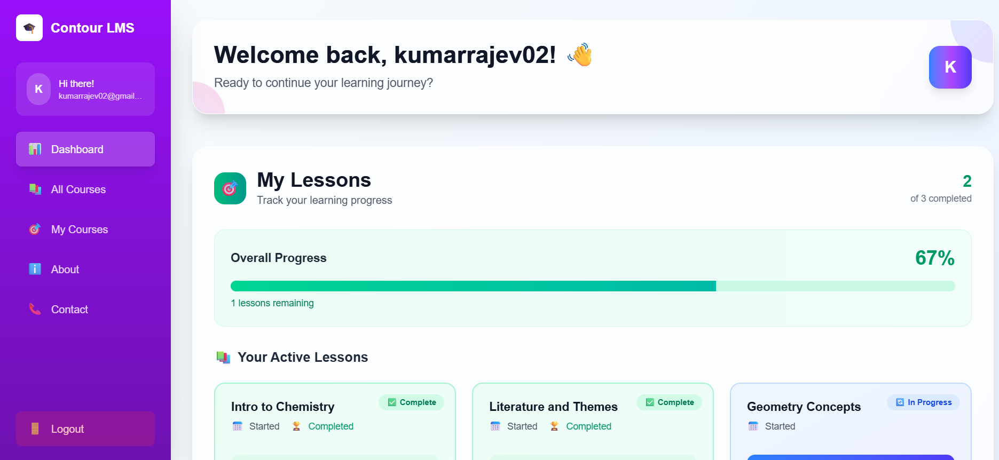
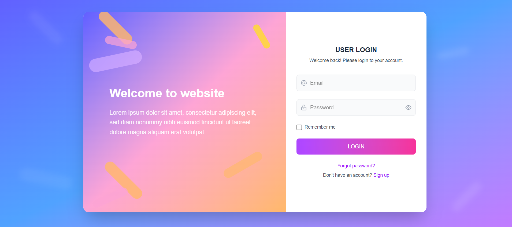

# 🧪 Lesson App – Full-Stack Learning Platform

A modern full-stack learning management application built with **Next.js** and **Supabase** that enables users to browse, take, and track their progress through educational lessons.

## 📸 Screenshots

### Dashboard Overview

*Main dashboard showing lesson progress and completion status*

### Authentication

*Secure user authentication with Supabase Auth*

---

## ✨ Features

- 🔐 **Secure Authentication** - Email/password login with Supabase Auth
- 📚 **Lesson Management** - Browse and access educational content
- ✅ **Progress Tracking** - Mark lessons as completed
- 📊 **Personal Dashboard** - View learning progress and statistics
- 🧠 **Server-side Validation** - Secure session management
- 🎨 **Modern UI** - Clean, responsive design
- ☁️ **Cloud-hosted** - Supabase backend with real-time updates

---

## 🛠️ Tech Stack

- **Frontend**: Next.js 14, React, TypeScript
- **Backend**: Supabase (PostgreSQL + Auth + Real-time)
- **Styling**: Tailwind CSS
- **Deployment**: Vercel (recommended)
- **Database**: PostgreSQL (Supabase Cloud)

---

## 🚀 Quick Start

### Prerequisites
- Node.js 18+ 
- npm or yarn
- Git

### 1. Clone the Repository
```bash
git clone https://github.com/your-username/lesson-app.git
```

### 2. Environment Setup
```bash
cp .env.example .env.local
```

Configure your environment variables in `.env.local`:
```env
NEXT_PUBLIC_SUPABASE_URL=your_supabase_project_url
NEXT_PUBLIC_SUPABASE_ANON_KEY=your_supabase_anon_key
```

> 📝 **Note**: Get your Supabase credentials from your [Supabase Dashboard](https://supabase.com/dashboard)

### 3. Install Dependencies
```bash
npm install
# or
yarn install
```

### 4. Run Development Server
```bash
npm run dev
# or
yarn dev
```

🎉 **Open [http://localhost:3000](http://localhost:3000)** in your browser!

---

## 🐳 Docker Setup (Optional)

For containerized development:

```bash
# Build and run with Docker Compose
docker-compose up --build

# Access at http://localhost:3000
```

---

## 📊 Database Schema

The application uses the following main tables:

- **`users`** - User profiles and authentication
- **`lessons`** - Lesson content and metadata  
- **`completions`** - User lesson completion tracking

Database schema is available in `supabase/schema.sql` with sample seed data included.

---

## 🗂️ Project Structure

```
lesson-app/
├── 📁 components/          # Reusable UI components
├── 📁 pages/              # Next.js pages and API routes
├── 📁 lib/                # Utility functions and Supabase client
├── 📁 styles/             # Global styles and Tailwind config
├── 📁 supabase/           # Database schema and migrations
├── 📁 screenshots/        # Application screenshots
├── 📁 public/             # Static assets
└── 📄 README.md           # This file
```

---

## 🔧 Available Scripts

```bash
npm run dev          # Start development server
npm run build        # Build for production
npm run start        # Start production server
npm run lint         # Run ESLint
npm run type-check   # Run TypeScript checks
```

---

## 🌐 Deployment

### Vercel (Recommended)
1. Push your code to GitHub
2. Connect your repository to [Vercel](https://vercel.com)
3. Add environment variables in Vercel dashboard
4. Deploy automatically on every push

### Other Platforms
The app can be deployed on any platform that supports Next.js:
- Netlify
- Railway
- AWS Amplify
- DigitalOcean App Platform

---

## 🤝 Contributing

1. Fork the repository
2. Create a feature branch (`git checkout -b feature/amazing-feature`)
3. Commit your changes (`git commit -m 'Add some amazing feature'`)
4. Push to the branch (`git push origin feature/amazing-feature`)
5. Open a Pull Request

---

## 📝 License

This project is licensed under the MIT License - see the [LICENSE](LICENSE) file for details.

---

## 👤 Author

**Your Name**
- GitHub: [@your-username](https://github.com/your-username)
- LinkedIn: [Your LinkedIn](https://linkedin.com/in/your-profile)
- Email: your.email@example.com

---

## 🆘 Support

If you encounter any issues or have questions:

1. Check the [Issues](https://github.com/your-username/lesson-app/issues) page
2. Create a new issue with detailed information
3. Join our [Discussions](https://github.com/your-username/lesson-app/discussions)

---

## 🙏 Acknowledgments

- [Next.js](https://nextjs.org/) for the amazing React framework
- [Supabase](https://supabase.com/) for the backend-as-a-service platform
- [Vercel](https://vercel.com/) for seamless deployment
- [Tailwind CSS](https://tailwindcss.com/) for utility-first styling

---

**Built with ❤️ as part of a learning assignment project**

⭐ Don't forget to star this repository if you found it helpful!